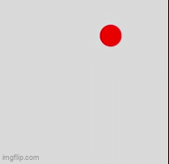
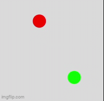

# Informatiklogbog
Dette er min logbog i informatik!! 
Her kommer mit arbejde til at ligge

# GRUNDFORLØBET
## Generelt
### Gestaltlove

I grundforløbet lærte vi om gestaltlove, som handler om, hvordan mennesker opfatter visuelle elementer og sammenhænge. Gestaltlovene hjælper med at forstå, hvordan man kan designe en app eller hjemmeside, så den bliver mere overskuelig og brugervenlig.  

Nogle af de vigtigste gestaltlove er nærhed, lighed og lukkethed. Nærhed betyder, at elementer der er tæt på hinanden, opfattes som hørende sammen. Lighed betyder, at elementer med samme farve eller form også opfattes som en gruppe. Lukkethed handler om, at vi automatisk forsøger at se hele former, selv hvis de ikke er helt færdigtegnede.  

I vores app brugte vi gestaltlovene til at gøre designet mere intuitivt. For eksempel placerede vi knapper tæt sammen og brugte ens ikoner, så det var nemt for brugeren at navigere mellem de forskellige sider. Det gjorde appen mere overskuelig og lettere at bruge.  

## Usertest
I grundforløbet arbejdede vi også med usertests, som er en metode til at teste et produkt eller en app på rigtige brugere. Formålet er at finde ud af, om designet er forståeligt, og om brugeren kan navigere i det uden at blive forvirret.  

Under en usertest giver man typisk en bruger en konkret opgave, f.eks. at finde en bestemt funktion i en app, mens man observerer deres adfærd. En vigtig del af metoden er, at brugeren tænker højt undervejs, hvilket betyder, at de løbende siger, hvad de tænker, hvad de leder efter, og hvad de er i tvivl om. Det gør det lettere at forstå, hvorfor de klikker som de gør, og hvor problemerne opstår.  

Efter testen samler man feedback og bruger den til at forbedre designet. Det kan f.eks. være ændringer i navigation, knapper eller layout, så appen bliver mere intuitiv og brugervenlig. I vores KIA-app kunne en usertest f.eks. afsløre, om brugeren nemt kunne finde rundt mellem siderne, og om symbolerne i menuen var tydelige nok.  

## App og interaktionsdesign
I grundforløbet lærte vi om nogle basale dele af kommunikation og it / informatik:
- Målgruppe
- Websitedesign
- Gestaltlove
- Skitser og prototype
- Etik og ophavsringsret

Vi fik en opgave, hvor vi skulle lave en app til et bilmærke i programmet applab: https://code.org/en-US/tools/app-lab  
Min gruppe skulle lave den for KIA.  
Link til projekt: https://studio.code.org/projects/applab/6p5d6A_sm2CYZYkjBDrZh0OexCwa22zVV5zDugN1mNQ/view  
  

I opgaven skulle vi først og fremmest analysere målgruppen; hvem er det altså, at vi laver appen til?  
Efter at have kigget på KIA's historie, og hvilke biler som de sælger, har vi valgt at rette vores målgruppe til:  
Familier i byer. For dem er det vigtigt med en bil, der har lang rækkevide, og skal være optimal til en køreferie. Som en nærmere indsnævring skal den være tunet med smarte funktioner, så den er tilpasset en yngre og mere nygående familie.  

Herefter overvejede vi, hvad vi skulle have i appen, og vi fandt frem til 
- Forside
- "Om os"
- Købsguide
- Bilmodeller
- En funktion, der kan vise til nærmeste forhandler
Vi gjorde brug af symboler i toppen af skærmen, så man nemt kan skifte mellem undersider 
 

# 1.g

## Programmering

### Første "projekt"
Det første vi startede med i forløbet var at lære om flowcharts, da de er en essentiel del af at kode, da det giver et visuelt overblik over, hvad man har tænkt sig at programmere, og man kan samtidig finde huller og mangler inden at man kæmper med den reelle kode.  
 
Dette var det første flowchart vi lavede. Flowchartet gengiver koden, som skulle være en bold, der flyver rundt på canvasset og skifter retning, når den rammer en væg

Her er koden, der er lavet ud fra flowchartet. https://editor.p5js.org/robertv2907/sketches/3PUSpVaiw 
 
Her ses en kørsel af koden: 
 
 

### Andet "projekt"
Link til p5.js https://editor.p5js.org/robertv2907/sketches/i67SnOzms  
 
I programmering lærte vi også om arrays. Et array er en måde at gemme flere værdier i én variabel i stedet for at lave mange separate variabler. Det gør koden mere overskuelig og nemmere at arbejde med, især når man har mange ens elementer, som f.eks. bolde i et spil.  
I vores kode med bolde brugte vi arrays til at gemme positioner (x og y), størrelser (r) og hastigheder (x_speed og y_speed). På den måde kunne vi bruge en løkke til at opdatere og tegne alle bolde, i stedet for at skrive den samme kode flere gange.  

Arrays er derfor smarte, fordi de gør det lettere at strukturere data og udvide et program, f.eks. hvis man vil gå fra 2 bolde til 10 bolde.  

Her ses et flowchart af koden 
 
 
 
Her ses et kodeudsnit, der viser for-loops 
 
 
 
Her ses en kørsel af koden 
 
 

### Projekt fra virtuel undervisning aka. "projekt" 3
Link til p5.js https://editor.p5js.org/robertv2907/sketches/_BF-40x5p 
 
I denne opgave arbejdede vi med en algoritme, der bygger på tilfældighed og gentagelser. Målet var at skabe et mønster ud fra tre tilfældige punkter, som tilsammen danner en Sierpiński-trekant.
Jeg valgte at lave koden så, at brugeren skal vælge tre punkter ved at klikke på canvaset. Disse punkter gemmes i arrays og fungerer som trekantens hjørner. Når alle tre punkter er valgt, vælges et tilfældigt startpunkt blandt dem.

Herefter starter programmet en løkke i draw(), hvor et af de tre hjørner hver gang vælges tilfældigt som destination. Det nuværende punkt flyttes derefter halvvejs mod denne destination, og der tegnes et nyt punkt på skærmen.

Da processen gentages mange gange i sekundet, opstår der et mønster, som ligner en Sierpiński-trekant.
 
Som suplement har jeg lavet et flowchart til koden
 
 
Med tiden dannes Sierpiński-trekanten 
 
 

## Kryptering og kryprografi
Efterfølgende arbejdede vi med kryptografi, som handler om at beskytte information ved at gøre den ulæselig for uvedkommende. 
I forbindelse med emnet lærte vi også om CIA-modellen, som er en grundlæggende model inden for IT-sikkerhed. 
Et klassisk eksempel er Caesar-kryptering, hvor bogstaver i en tekst forskydes et bestemt antal pladser i alfabetet, så beskeden bliver ulæselig uden nøglen. 
 
Som en del af forløbet lavede vi også et projekt i p5.js, hvor vi programmerede en Caesar-kryptering. 

## 3D-design og -print

## Arduino vejrstation
